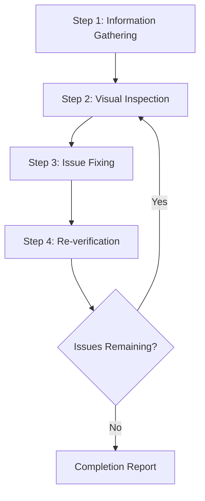

# Web Design Reviewer

Curated from a previously merged skill. This file keeps the useful task guidance without preserving the old skill as an active nested skill.

## Guidance

### From `web-design-reviewer-skill.md`

_Source topic: web-design-reviewer_

**Purpose:** This skill enables visual inspection of websites running locally or remotely to identify and fix design issues. Triggers on requests like "review website design", "check the UI", "fix the layout", "find design problems". Detects issues with responsive design, accessibility, visual consistency, and layout breakage, then performs fixes at the source code level.

# Web Design Reviewer

This skill enables visual inspection and validation of website design quality, identifying and fixing issues at the source code level.

## Scope of Application

- Static sites (HTML/CSS/JS)
- SPA frameworks such as React / Vue / Angular / Svelte
- Full-stack frameworks such as Next.js / Nuxt / SvelteKit
- CMS platforms such as WordPress / Drupal
- Any other web application

## Prerequisites

### Required

1. **Target website must be running**
   - Local development server (e.g., `http://localhost:3000`)
   - Staging environment
   - Production environment (for read-only reviews)

2. **Browser automation must be available**
   - Screenshot capture
   - Page navigation
   - DOM information retrieval

3. **Access to source code (when making fixes)**
   - Project must exist within the workspace

## Workflow Overview



## Step 2: Visual Inspection Phase
...


### From `web-design-guidelines-skill.md`

_Source topic: web-design-guidelines_

**Purpose:** Review UI code for Web Interface Guidelines compliance. Use when asked to "review my UI", "check accessibility", "audit design", "review UX", or "check my site against best practices".

# Web Interface Guidelines

Review files for compliance with Web Interface Guidelines.

## How It Works

1. Fetch the latest guidelines from the source URL below
2. Read the specified files (or prompt user for files/pattern)
3. Check against all rules in the fetched guidelines
4. Output findings in the terse `file:line` format

## Guidelines Source

```
https://raw.githubusercontent.com/vercel-labs/web-interface-guidelines/main/command.md
```

Use WebFetch to retrieve the latest rules. The fetched content contains all the rules and output format instructions.

## Usage

When a user provides a file or pattern argument:
1. Fetch guidelines from the source URL above
2. Read the specified files
3. Apply all rules from the fetched guidelines
4. Output findings using the format specified in the guidelines


### From `framework-fixes.md`

_Source topic: framework-fixes_

# Framework-specific Fix Guide
This document explains specific fix techniques for each framework and styling method.
## Tailwind CSS
### Layout Fixes
```jsx
{/* Before: Overflow */}
<div className="w-full">
  
</div>
{/* After: Overflow control */}
<div className="w-full max-w-full overflow-hidden">
  
</div>
```
### Text Clipping Prevention
```jsx
{/* Single line truncation */}
<p className="truncate">Long text...</p>
{/* Multi-line truncation */}
<p className="line-clamp-3">Long text...</p>
{/* Allow wrapping */}
<p className="break-words">Long text...</p>
```
### Responsive Support
```jsx
{/* Mobile-first responsive */}
<div className="
  flex flex-col gap-4
  md:flex-row md:gap-6
  lg:gap-8
">
  <div className="w-full md:w-1/2 lg:w-1/3">
    Content
  </div>
</div>
```
### Spacing Unification (Tailwind Config)
```javascript
// tailwind.config.js
module.exports = {
  theme: {
    extend: {
      spacing: {
        '18': '4.5rem',
        '22': '5.5rem',
      },
    },
  },
}
```
### Accessibility Improvements
```jsx
{/* Add focus state */}
<button className="
  bg-blue-500 text-white

### From `visual-checklist.md`

_Source topic: visual-checklist_

# Visual Inspection Checklist

This document is a comprehensive checklist of items to verify during web design visual inspection.

## 2. Typography Verification

### Readability

- [ ] Body text font size is sufficient (minimum 16px recommended)
- [ ] Line height is appropriate (1.5-1.8 recommended)
- [ ] Characters per line is appropriate (40-80 characters recommended)
- [ ] Spacing between paragraphs is sufficient
- [ ] Heading size hierarchy is clear

### Text Handling

- [ ] Long words wrap appropriately
- [ ] URLs and code are handled properly
- [ ] No text clipping occurs
- [ ] Ellipsis (...) displays correctly
- [ ] Language-specific line breaking rules work correctly

### Fonts

- [ ] Web fonts load correctly
- [ ] Fallback fonts are appropriate
- [ ] Font weights are as intended
- [ ] Special characters and emoji display correctly

## 4. Responsive Verification

### Mobile (~640px)

- [ ] Content fits within screen width
- [ ] Touch targets are 44x44px or larger
- [ ] Text is readable size
...
